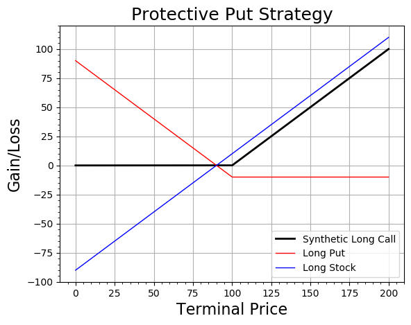
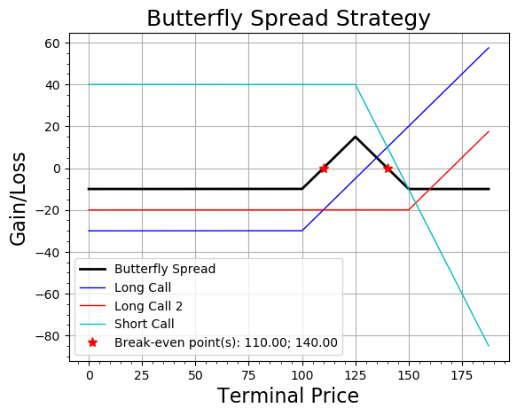

# Option Hedging Strategies
## Purpose
To start with some basic definitions, options are financial instruments, also known as derivatives of which values are based on underlying assets such as stocks. Options are contracts that give the buyer the right but not the obligation, to buy (in case of call option) or sell (in case of put option) the underlying assets at a specified strike price prior to or on expiration date. An option buyer pay an amount called 'premium' to the seller at the time of purchase. The buyer is now in a long position while the seller is in short position of the option.  Prior or on the expiration date, if the buyer decides to exercise the contract, the seller is obliged to satisfy.

Options can be used to hedge against an existing portfolio based on the portfolio manager's expectation on the underlying asset price movement. There are a number of option hedging strategies such as protective put, covered call, bull spread, bear spread, butterfly spread, straddle and strangle.

The purpose of this repo is to visualise all these option hedging strategies given your own input. You will be required to input details of one or more options such as strike price, premium and quantity. Then a graph will be plotted with automatic scaling and titling as well as saved as a png file. Break-even point(s) will also be displayed.

## Usage
First of all, you can explore all arguments that you are able to input by running ```python Options.py -h```
For example, you want to see how a long put and a long postion of stock look like. The long put has a strike price (k) of $100, premium (p) is $10, quantity (n) is 1. You have also bought a stock at $90.

Please remember that when you buy an option, you need to input negative premium value (p) as this is the amount you pay.

```python Options.py --lp --lpv 100 -10 1 --lpos --lposv 90 1```

will results the output like this:



Please be aware that you are able to input two long options and/or two short options with different strike prices. For example, you buy one call option with k = $100, p = $30 and another one with k = $150, p = $20. You also sell a call option with k = $125, p = $20

```python Options.py --lc --lcv 100 -30 1 --lc2 --lcv2 150 -20 1 --sc --scv 125 20 2```

will results the output like this:


